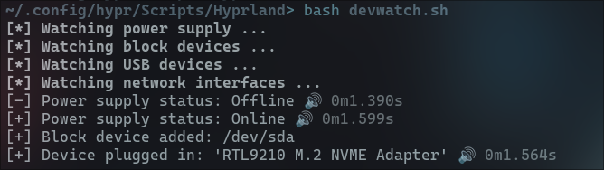

# Device Watcher
Robust notification script for device events



## 🔗 Features
* Block device notifications
* USB device notifications
* Network interface notifications
* Power adapter notifications
* Transient notifications
* stdout logging

## How to use
If you want to try out the script you simply run it with ```bash devwatch.sh``` in its respected directory.

If you want to have it run in the background: ```bash devwatch.sh & disown``` 

And to execute it on startup add a line like this to your window managers configuration: ```exec-once = bash ~/.config/hypr/Scripts/Hyprland/devwatch.sh``` <sup>*Hyprland*</sup>
